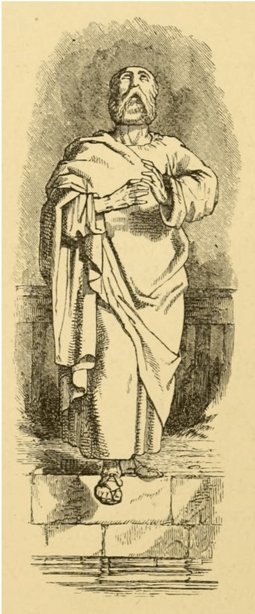

<!-- _class: titre -->

# Introduction à  la philosophie <!-- fit -->
Cédric Eyssette (2020-2021)
https://eyssette.net/

---
<!-- _class: partie -->
# I – Qu'est-ce que  la philosophie ? <!-- fit -->
Première partie

---
<!-- _class: souspartie -->
## A. Première approche <!-- fit -->

Faire de la philosophie : c'est …
Un philosophe, c'est …
La philosophie, c'est …

---
<!-- _class: i1t0 pp pm -->

---
<!-- _class: pointmethode fpppppppp -->
### Point méthode
- En philosophie, c'est très utile de partie de ses représentations spontanées ou de lieux communs à propos d'une notion.
- C'est un premier matériau qu'on peut analyser, avec de l'esprit critique.

---
<!-- _class: i1t0 pp -->

Image fiche synthèse à mettre

---
<!-- _class: grille pp -->

---
<!-- _class: i1t0  pm -->

---
<!-- _class: pointmethode fpppppp -->

### Point méthode
Pour analyser une notion, on peut partir d'une approche très générale, et chercher ensuite à préciser cette approche.

  Terme technique :  « définition par genre et différence spécifique »

---
<!-- _class: fmm -->

1. La liberté n’est-elle qu’une illusion ?
2. Y a-t-il une vérité en morale ?
3. Croire en l’existence d’un dieu, est-ce rationnel ?
4. Qu’est-ce qu’une loi juste ?
5. À quoi bon travailler ?
6. Est-il possible de connaître quelque chose avec certitude ?
7. À quoi servent les artistes ?

- Qu’est-ce que ces questions ont de particulier ?
- Qu’est-ce qui distingue ces questions d’une question ordinaire comme : « quelle heure est-il ? »
- Qu’est-ce qui distingue ces questions d’une question d’une autre discipline comme : « que s’est-il passé pendant la Révolution française ? »

---
<!-- _class: souspartie -->
## B. Trois démarches essentielles

---
<!-- _class: etape  -->
### 1/ Conceptualiser 

---
<!-- _class: fmmm -->

- Dans les sujets de dissertation du bac 2019, quels sont les termes qu'il fallait conceptualiser ?

- **TL**
  - « Est-il possible d'échapper au temps ? »
  - « À quoi bon expliquer une oeuvre d’art ? »
- **TES**
  - « La morale est-elle la meilleure des politiques ? »
  - « Le travail divise-t-il les hommes ? »
- **TS**
  - « La pluralité des cultures fait-elle obstacle à l’unité du genre humain ? »
  - « Reconnaître ses devoirs, est-ce renoncer à sa liberté ? »
- **Technologiques**
  - « Seul ce qui peut s’échanger a-t-il de la valeur ? »
  - « Les lois peuvent-elles faire notre bonheur ? »

---
<!-- _class: pointmethode -->
### Point méthode
Les sujets de dissertation sont généralement constitués par deux notions principales, qu'il faut parvenir à conceptualiser.
